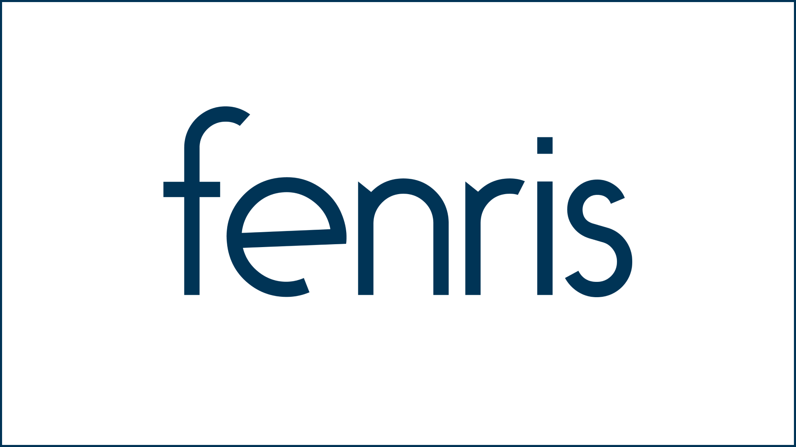

### Fenris

Fenris is a consultant network founded by [Aman Ahuja](https://github.com/amanahuja) to **support teams developing responsible data systems for public benefit**.

We work to make these ventures successful and sustainable through collaborative co-design of product strategy, equitable data governance, and targeted technical assistance.

- 🏠 Website: [gofenris.com](https://gofenris.com)
- 💬 Inquiries:
  - Submit the [contact form](https://gofenris.com/#contact) on our website
  - Reach the Fenris team at [hello@gofenris.com](hello@gofenris.com)
